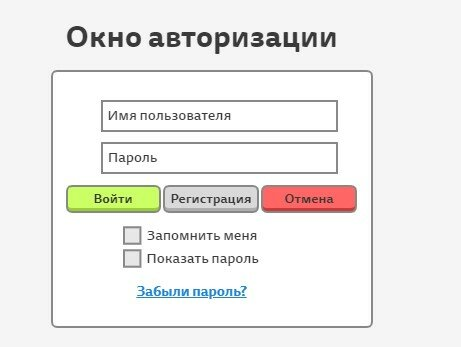
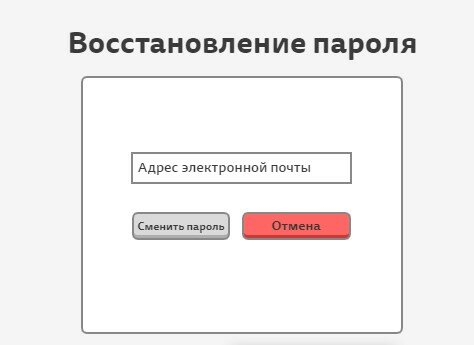
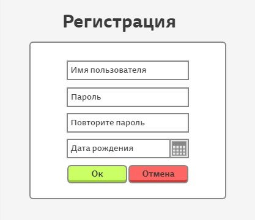
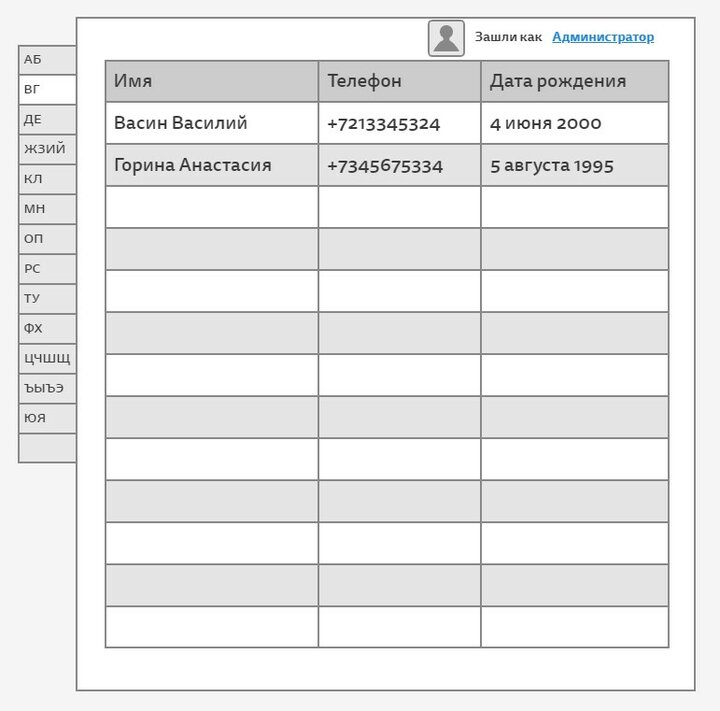

# testwork2

Task

### Тестовое задание:
Необходимо написать программу – телефонную книжку.

### Сценарий использования:
1. Пользователь включает программу, перед ним появляется окно авторизации ( при первом входе. При включенном чекбоксе – «Запомнить меня» необходимо входить автоматически)

2. Пользователь вводит логин и пароль, нажимает кнопку «Войти». В случае нахождения пользователя с такой комбинацией программа переходит к главному меню, в случае отсутствия появляется всплывающее окно «Пользователь с такими данными не найден»
3. Если пользователь забыл пароль – по нажатию на ссылку «Забыли пароль?» открывается окно «Восстановление пароля»

4. При нажатии на кнопку «Регистрация» открывается окно «Регистрация»

5. В случае успешного входа/регистрации перед пользователем открывается главное окно с навигацией по Алфавиту.

### Список требований к программе:
1. В программе должна быть реализована функция напоминаний ( при открытии программы необходимо показывать список именинников на ближайшую неделю)
2. В программе должны быть реализованы функции:
    * Добавление нового контакта
    * Редактирование существующего контакта
    * Удаление существующего контакта
3. В программе должен быть логический контроль дубликатов ( программа должна запрещать записывать нового пользователя, если совпадает ФИО + дата рождения + номер телефона)
4. Программа должна автоматически переносить созданную запись на нужную страницу в алфавитном указателе и информировать об этом пользователя)

### Стек используемых технологий:
PyQt4 + python 2.7; в качестве СУБД использовать Mariadb 10.4 и выше.
В качестве решения предоставить ссылку на репозиторий, а также подробную инструкцию по установке на linux/windows.

